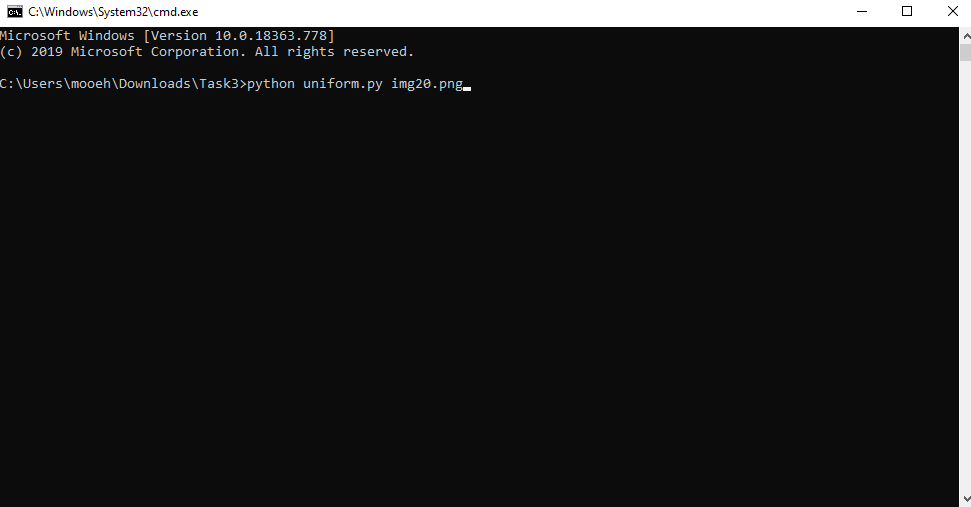
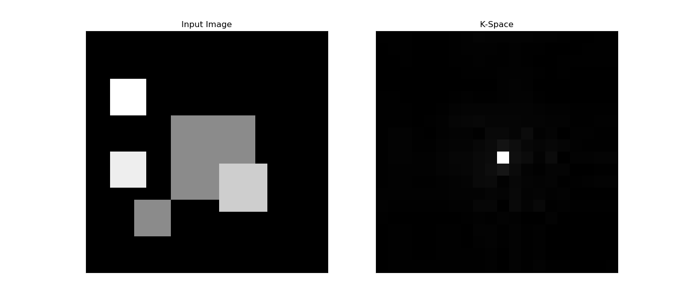
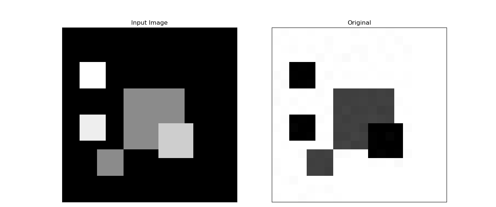
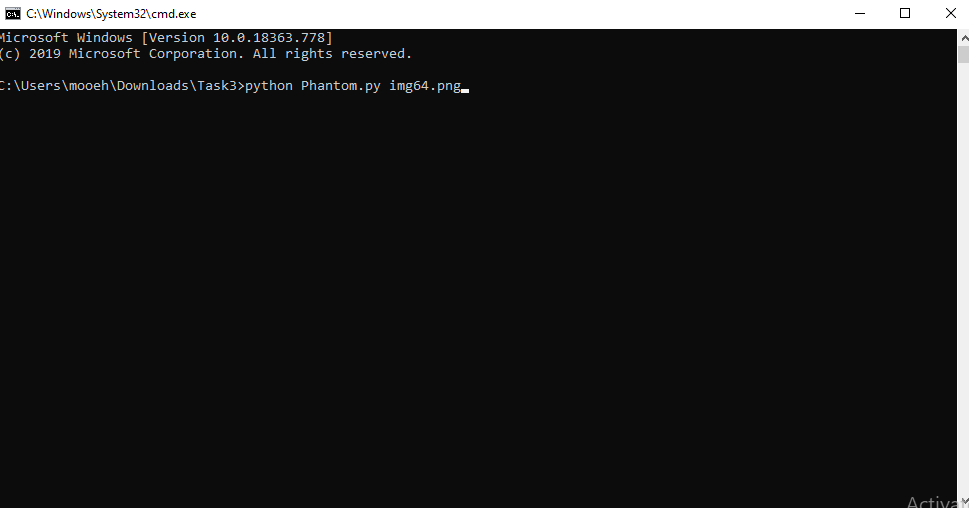
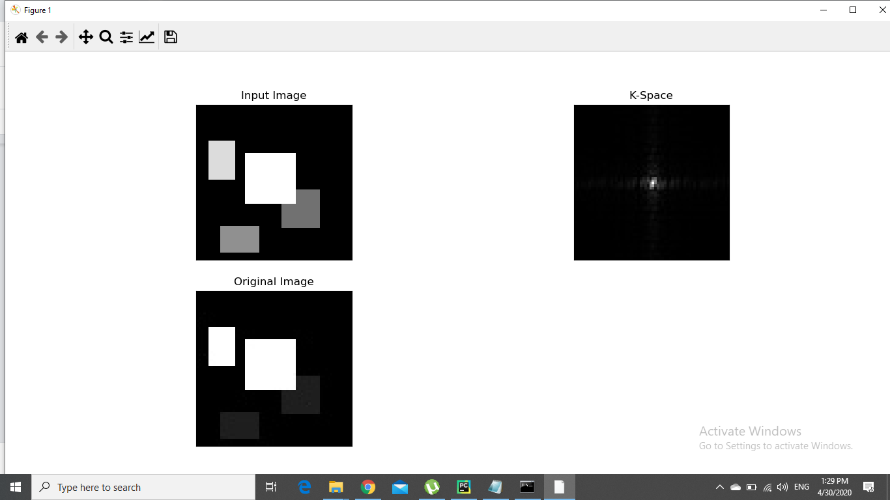

* # How to run the code
* ## Task 3 MRI

* # Abstract:
    In this report i will discuss how to run the code correctly.
* # What to write in the terminal:

   * ## To run The K-Space function on an image:
		* ## Run "uniform.py" file
			* ### Passing one more argument: -name of any Image in this repository.
		
   
    		
		* ## you will get result like this:
			###Kspace of the image:
		

			###Inverse of the image:
		

    * ## To run The Nonuniformity & KSpace function:
		* ## Run "Phantom.py" file 
			* ### Passing 1 more arguments: 
				-name of any Image in this repository.
		
		
    	
	* ## you will get these two results:
		* ### Kspace& Inverse image:
		
		

